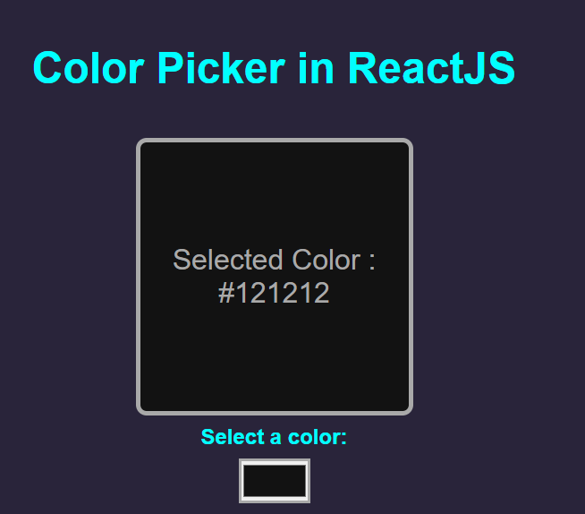

# Color Picker App

A simple Color Picker application built with React. This app allows users to select and view different colors.

Understanding how useState work in ReactJS

## Features

- **Color Selection**: Users can pick a color using a color input.
- **Color Display**: Displays the selected color in a preview box.
- **Hex Code Display**: Shows the hex code of the selected color.

## Demo

